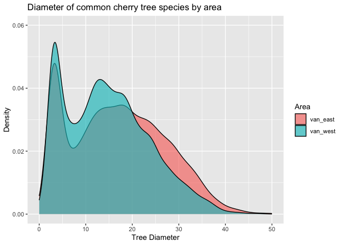

Mini Data Analysis Milestone 2
================

*To complete this milestone, you can either edit [this `.rmd`
file](https://raw.githubusercontent.com/UBC-STAT/stat545.stat.ubc.ca/master/content/mini-project/mini-project-2.Rmd)
directly. Fill in the sections that are commented out with
`<!--- start your work here--->`. When you are done, make sure to knit
to an `.md` file by changing the output in the YAML header to
`github_document`, before submitting a tagged release on canvas.*

# Welcome to the rest of your mini data analysis project!

In Milestone 1, you explored your data. and came up with research
questions. This time, we will finish up our mini data analysis and
obtain results for your data by:

- Making summary tables and graphs
- Manipulating special data types in R: factors and/or dates and times.
- Fitting a model object to your data, and extract a result.
- Reading and writing data as separate files.

We will also explore more in depth the concept of *tidy data.*

**NOTE**: The main purpose of the mini data analysis is to integrate
what you learn in class in an analysis. Although each milestone provides
a framework for you to conduct your analysis, it’s possible that you
might find the instructions too rigid for your data set. If this is the
case, you may deviate from the instructions – just make sure you’re
demonstrating a wide range of tools and techniques taught in this class.

# Instructions

**To complete this milestone**, edit [this very `.Rmd`
file](https://raw.githubusercontent.com/UBC-STAT/stat545.stat.ubc.ca/master/content/mini-project/mini-project-2.Rmd)
directly. Fill in the sections that are tagged with
`<!--- start your work here--->`.

**To submit this milestone**, make sure to knit this `.Rmd` file to an
`.md` file by changing the YAML output settings from
`output: html_document` to `output: github_document`. Commit and push
all of your work to your mini-analysis GitHub repository, and tag a
release on GitHub. Then, submit a link to your tagged release on canvas.

**Points**: This milestone is worth 50 points: 45 for your analysis, and
5 for overall reproducibility, cleanliness, and coherence of the Github
submission.

**Research Questions**: In Milestone 1, you chose two research questions
to focus on. Wherever realistic, your work in this milestone should
relate to these research questions whenever we ask for justification
behind your work. In the case that some tasks in this milestone don’t
align well with one of your research questions, feel free to discuss
your results in the context of a different research question.

# Learning Objectives

By the end of this milestone, you should:

- Understand what *tidy* data is, and how to create it using `tidyr`.
- Generate a reproducible and clear report using R Markdown.
- Manipulating special data types in R: factors and/or dates and times.
- Fitting a model object to your data, and extract a result.
- Reading and writing data as separate files.

# Setup

Begin by loading your data and the tidyverse package below:

``` r
library(datateachr) # <- might contain the data you picked!
library(tidyverse)
library(dplyr)
library(ggplot2)
library(broom)
library(readr)
library(here)
```

# Task 1: Process and summarize your data

From milestone 1, you should have an idea of the basic structure of your
dataset (e.g. number of rows and columns, class types, etc.). Here, we
will start investigating your data more in-depth using various data
manipulation functions.

### 1.1 (1 point)

First, write out the 4 research questions you defined in milestone 1
were. This will guide your work through milestone 2:

<!-------------------------- Start your work below ---------------------------->

1.  *Question 1: How many cherry trees are there Vancouver west and
    Vancouver east?* - Answered this question in the first summarizing
    activity - I add to it in it’s section to include differences in
    planting times between the areas.

2.  *Question 2: Which neighborhood has the highest density of each of
    the cherry tree species?* - This question was changed to - *What is
    the relationship between location and common cherry tree
    diameter?* - I thought that the new question would give me the
    opportunity to answer questions using the more numerical side of the
    data set.

3.  *Question 3: Is there a relationship between the location of the
    cherry trees and their height?* slightly changed this question to -
    *In which area are trees larger? Vancouver east or Vancouver west?.*
    I did this because the height ID variable did not seem to be
    continuous.

4.  *Question 4: Is there a geographical area of Vancouver where the
    city planted more cherry trees? If so, does it differ by decade?*

<!----------------------------------------------------------------------------->

Here, we will investigate your data using various data manipulation and
graphing functions.

### 1.2 (8 points)

Now, for each of your four research questions, choose one task from
options 1-4 (summarizing), and one other task from 4-8 (graphing). You
should have 2 tasks done for each research question (8 total). Make sure
it makes sense to do them! (e.g. don’t use a numerical variables for a
task that needs a categorical variable.). Comment on why each task helps
(or doesn’t!) answer the corresponding research question.

Ensure that the output of each operation is printed!

Also make sure that you’re using dplyr and ggplot2 rather than base R.
Outside of this project, you may find that you prefer using base R
functions for certain tasks, and that’s just fine! But part of this
project is for you to practice the tools we learned in class, which is
dplyr and ggplot2.

**Summarizing:**

1.  Compute the *range*, *mean*, and *two other summary statistics* of
    **one numerical variable** across the groups of **one categorical
    variable** from your data.

2.  Compute the number of observations for at least one of your
    categorical variables. Do not use the function `table()`!

3.  Create a categorical variable with 3 or more groups from an existing
    numerical variable. You can use this new variable in the other
    tasks! *An example: age in years into “child, teen, adult, senior”.*

4.  Compute the proportion and counts in each category of one
    categorical variable across the groups of another categorical
    variable from your data. Do not use the function `table()`!
    **Graphing:**

5.  Create a graph of your choosing, make one of the axes logarithmic,
    and format the axes labels so that they are “pretty” or easier to
    read.

6.  Make a graph where it makes sense to customize the alpha
    transparency.

Using variables and/or tables you made in one of the “Summarizing”
tasks:

8.  Create a graph that has at least two geom layers.
9.  Create 3 histograms, with each histogram having different sized
    bins. Pick the “best” one and explain why it is the best.

Make sure it’s clear what research question you are doing each operation
for!

<!------------------------- Start your work below ----------------------------->

**Question 4: Is there a geographical area of Vancouver where the city
planted more cherry trees? If so, does it differ by decade?** To start
off, I need to put the common Vancouver cherry trees together. I chose
the 8 most common cherry trees. This is so that there would be enough
data points for each species throughout the analysis.

``` r
com_cherry <- vancouver_trees %>% 
  filter(common_name %in% c("KWANZAN FLOWERING CHERRY", "AKEBONO FLOWERING CHERRY", "SCHUBERT CHOKECHERRY", "PINK PERFECTION CHERRY", "JAPANESE FLOWERING CHERRY", "HIGAN CHERRY", "MAZZARD CHERRY", "RANCHO SARGENT CHERRY"))

print(com_cherry)
```

    ## # A tibble: 15,349 × 20
    ##    tree_id civic_number std_street       genus_name species_name cultivar_name
    ##      <dbl>        <dbl> <chr>            <chr>      <chr>        <chr>        
    ##  1  155243          501 E KING EDWARD AV PRUNUS     SERRULATA    KWANZAN      
    ##  2  155251         4099 CAROLINA ST      PRUNUS     SERRULATA    KWANZAN      
    ##  3  155335          501 E KING EDWARD AV PRUNUS     SERRULATA    KWANZAN      
    ##  4  155336          501 E KING EDWARD AV PRUNUS     SERRULATA    KWANZAN      
    ##  5  155531          105 E 50TH AV        PRUNUS     X YEDOENSIS  AKEBONO      
    ##  6  155612         8340 PRINCE EDWARD ST PRUNUS     VIRGINIANA   SCHUBERT     
    ##  7  155709         4494 ST. GEORGE ST    PRUNUS     SERRULATA    KWANZAN      
    ##  8  156025         8023 LAUREL ST        PRUNUS     SERRULATA    KWANZAN      
    ##  9  156255          118 W KING EDWARD AV PRUNUS     SERRULATA    KWANZAN      
    ## 10  156258          138 W KING EDWARD AV PRUNUS     SERRULATA    KWANZAN      
    ## # ℹ 15,339 more rows
    ## # ℹ 14 more variables: common_name <chr>, assigned <chr>, root_barrier <chr>,
    ## #   plant_area <chr>, on_street_block <dbl>, on_street <chr>,
    ## #   neighbourhood_name <chr>, street_side_name <chr>, height_range_id <dbl>,
    ## #   diameter <dbl>, curb <chr>, date_planted <date>, longitude <dbl>,
    ## #   latitude <dbl>

**Summarizing** (4.Compute the proportion and counts in each category of
one categorical variable across the groups of another categorical
variable from your data. Do not use the function `table()`!)

``` r
freq_cher <- com_cherry %>%
  group_by(common_name, neighbourhood_name) %>%
  summarise(n = n(), .groups = "drop_last") %>%
  mutate(freq = n / sum(n))

print(freq_cher)
```

    ## # A tibble: 159 × 4
    ## # Groups:   common_name [8]
    ##    common_name              neighbourhood_name           n    freq
    ##    <chr>                    <chr>                    <int>   <dbl>
    ##  1 AKEBONO FLOWERING CHERRY ARBUTUS-RIDGE               61 0.0256 
    ##  2 AKEBONO FLOWERING CHERRY DOWNTOWN                     8 0.00336
    ##  3 AKEBONO FLOWERING CHERRY DUNBAR-SOUTHLANDS          234 0.0982 
    ##  4 AKEBONO FLOWERING CHERRY FAIRVIEW                    41 0.0172 
    ##  5 AKEBONO FLOWERING CHERRY GRANDVIEW-WOODLAND          90 0.0378 
    ##  6 AKEBONO FLOWERING CHERRY HASTINGS-SUNRISE           199 0.0835 
    ##  7 AKEBONO FLOWERING CHERRY KENSINGTON-CEDAR COTTAGE   122 0.0512 
    ##  8 AKEBONO FLOWERING CHERRY KERRISDALE                 160 0.0671 
    ##  9 AKEBONO FLOWERING CHERRY KILLARNEY                   48 0.0201 
    ## 10 AKEBONO FLOWERING CHERRY KITSILANO                   89 0.0373 
    ## # ℹ 149 more rows

The above I calculated the frequency of each of the the 8 most common
species of cherry trees in Vancouver by neighbourhood name.

**Graphing** (8. Create a graph that has at least two geom layers.)

Now for graphing I’m going to look at how the species planted may differ
over time. Attempting to answer the second half of Question 4, regarding
time.

``` r
cher_box <- com_cherry %>%
  ggplot( aes(x = common_name, y = date_planted, fill = common_name)) +
    geom_violin(width=2.0) +
    geom_boxplot(width=0.5, alpha=0.2) +
    ylab("Date Planted") +
    xlab("Common Name") +
    ggtitle("Common Cherry Trees Species in Vancouver", subtitle = "by date planted" ) +
            theme(axis.text.x = element_text(angle = 90, size = 0), legend.key.size = unit(0.5, "cm"))

print(cher_box)
```

    ## Warning: Removed 11293 rows containing non-finite values (`stat_ydensity()`).

    ## Warning: Groups with fewer than two data points have been dropped.

    ## Warning: Removed 11293 rows containing non-finite values (`stat_boxplot()`).

    ## Warning: `position_dodge()` requires non-overlapping x intervals

<!-- -->

Above I utilized 2 types of geoms, geom_box plot() and geom_violin().

Combining these two geoms makes it easy to visualize when the most
common cherry trees in Vancouver were planted for those we have planting
data on.

**Question 3: Is there a relationship between the location of the cherry
trees and their height?**

**Summarizing** (3. Create a categorical variable with 3 or more groups
from an existing numerical variable. You can use this new variable in
the other tasks! \*An example: age in years into “child, teen, adult,
senior”)

``` r
cherry_area <- com_cherry %>% mutate(area = case_when(
  neighbourhood_name %in% c("ARBUTUS-RIDGE", "DOWNTOWN", "FAIRVIEW", "DUNBAR-SOUTHLANDS", "KERRISDALE", "SHAUGHNESSY", "MARPOLE", "OAKRIDGE", "SOUTH CAMBIE", "KITSILANO", "WEST POINT GREY", "WEST END") ~'van_west', TRUE ~ 'van_east')) %>% 
  arrange(area)

glimpse(cherry_area)
```

    ## Rows: 15,349
    ## Columns: 21
    ## $ tree_id            <dbl> 155243, 155251, 155335, 155336, 155531, 155612, 155…
    ## $ civic_number       <dbl> 501, 4099, 501, 501, 105, 8340, 4494, 118, 138, 335…
    ## $ std_street         <chr> "E KING EDWARD AV", "CAROLINA ST", "E KING EDWARD A…
    ## $ genus_name         <chr> "PRUNUS", "PRUNUS", "PRUNUS", "PRUNUS", "PRUNUS", "…
    ## $ species_name       <chr> "SERRULATA", "SERRULATA", "SERRULATA", "SERRULATA",…
    ## $ cultivar_name      <chr> "KWANZAN", "KWANZAN", "KWANZAN", "KWANZAN", "AKEBON…
    ## $ common_name        <chr> "KWANZAN FLOWERING CHERRY", "KWANZAN FLOWERING CHER…
    ## $ assigned           <chr> "Y", "Y", "Y", "Y", "N", "N", "N", "N", "N", "N", "…
    ## $ root_barrier       <chr> "N", "N", "N", "N", "N", "N", "N", "N", "N", "N", "…
    ## $ plant_area         <chr> NA, NA, NA, NA, "7", "N", "7", "N", "N", "10", "7",…
    ## $ on_street_block    <dbl> 4000, 4000, 4000, 4000, 100, 8300, 4400, 100, 100, …
    ## $ on_street          <chr> "CAROLINA ST", "CAROLINA ST", "CAROLINA ST", "CAROL…
    ## $ neighbourhood_name <chr> "RILEY PARK", "RILEY PARK", "RILEY PARK", "RILEY PA…
    ## $ street_side_name   <chr> "EVEN", "ODD", "EVEN", "EVEN", "ODD", "EVEN", "EVEN…
    ## $ height_range_id    <dbl> 2, 2, 2, 2, 2, 2, 2, 3, 2, 3, 2, 2, 2, 2, 2, 2, 2, …
    ## $ diameter           <dbl> 17.00, 9.00, 16.00, 9.00, 5.50, 3.00, 6.50, 12.00, …
    ## $ curb               <chr> "Y", "Y", "Y", "Y", "Y", "Y", "Y", "Y", "Y", "Y", "…
    ## $ date_planted       <date> NA, NA, NA, NA, 1998-03-03, 1994-05-30, 1996-12-11…
    ## $ longitude          <dbl> -123.0922, NA, -123.0922, -123.0922, -123.1033, NA,…
    ## $ latitude           <dbl> 49.24951, NA, 49.24885, 49.24897, 49.22481, NA, 49.…
    ## $ area               <chr> "van_east", "van_east", "van_east", "van_east", "va…

Above I used the mutate() dplyr function to divide neighbourhood names
into their respective areas (Vancouver west & Vancouver east). This did
not make sense for me to do with a numerical variable with my data set
and what I wanted to do.

``` r
van_west <- as_tibble(cherry_area) %>%
filter(area == "van_west") %>%
  select(date_planted, common_name, area)
van_west
```

    ## # A tibble: 7,227 × 3
    ##    date_planted common_name               area    
    ##    <date>       <chr>                     <chr>   
    ##  1 NA           KWANZAN FLOWERING CHERRY  van_west
    ##  2 NA           KWANZAN FLOWERING CHERRY  van_west
    ##  3 NA           JAPANESE FLOWERING CHERRY van_west
    ##  4 NA           KWANZAN FLOWERING CHERRY  van_west
    ##  5 NA           HIGAN CHERRY              van_west
    ##  6 NA           KWANZAN FLOWERING CHERRY  van_west
    ##  7 NA           KWANZAN FLOWERING CHERRY  van_west
    ##  8 NA           KWANZAN FLOWERING CHERRY  van_west
    ##  9 NA           KWANZAN FLOWERING CHERRY  van_west
    ## 10 1996-03-18   AKEBONO FLOWERING CHERRY  van_west
    ## # ℹ 7,217 more rows

``` r
van_east <- as_tibble(cherry_area) %>%
filter(area == "van_east") %>%
  select(date_planted, common_name, area)
van_east
```

    ## # A tibble: 8,122 × 3
    ##    date_planted common_name              area    
    ##    <date>       <chr>                    <chr>   
    ##  1 NA           KWANZAN FLOWERING CHERRY van_east
    ##  2 NA           KWANZAN FLOWERING CHERRY van_east
    ##  3 NA           KWANZAN FLOWERING CHERRY van_east
    ##  4 NA           KWANZAN FLOWERING CHERRY van_east
    ##  5 1998-03-03   AKEBONO FLOWERING CHERRY van_east
    ##  6 1994-05-30   SCHUBERT CHOKECHERRY     van_east
    ##  7 1996-12-11   KWANZAN FLOWERING CHERRY van_east
    ##  8 NA           KWANZAN FLOWERING CHERRY van_east
    ##  9 NA           KWANZAN FLOWERING CHERRY van_east
    ## 10 NA           PINK PERFECTION CHERRY   van_east
    ## # ℹ 8,112 more rows

Instead of using the height_id for the trees I decided to use the
diameter. The height ID value seems to have less variation between
different tree types.

My new question would be: **In which area are trees larger? Vancouver
east or Vancouver west?.**

**Graphing** (7. Make a graph where it makes sense to customize the
alpha transparency)

``` r
dia_cherry<-ggplot(cherry_area, aes(x = diameter, fill = area)) +
  geom_density(colour= "black", alpha = 0.65) +
  labs(title = "Diameter of common cherry tree species by area", fill = "Area") + 
  scale_x_continuous(name="Tree Diameter", limits=c(0, 50)) +
  scale_y_continuous(name="Density", limits=c(0, 0.06)) 
  
print(dia_cherry)
```

    ## Warning: Removed 5 rows containing non-finite values (`stat_density()`).

<!-- -->

I customized alpha transparency in the density plot so that you could
properly see both areas (Vancouver west & Vancouver east).

**Question 1: How many cherry trees are there Vancouver west and
Vancouver east?**

**Summarizing** (2. Compute the number of observations for at least one
of your categorical variables. Do not use the function `table()`!)

``` r
no_area <- cherry_area %>% 
  group_by(area) %>% 
  summarise(Count = n())

print(no_area)
```

    ## # A tibble: 2 × 2
    ##   area     Count
    ##   <chr>    <int>
    ## 1 van_east  8122
    ## 2 van_west  7227

Above I calculated the number of the 8 most common cherry trees for the
areas of Vancouver west and Vancouver east. In doing this I can see that
there are slightly more trees in the neighborhoods which make up
Vancouver east than there in in Vancouver west.

In doing the above count I answered my first question. So, for the
graphing part I will investigate further and see if there in a
difference in between the number of the 8 most common cherry tress
planted by planting year.

``` r
cher_dat <- cherry_area %>% 
  mutate(Month = month(date_planted, label = TRUE), Year = year (ymd(date_planted)))

glimpse(cher_dat)
```

    ## Rows: 15,349
    ## Columns: 23
    ## $ tree_id            <dbl> 155243, 155251, 155335, 155336, 155531, 155612, 155…
    ## $ civic_number       <dbl> 501, 4099, 501, 501, 105, 8340, 4494, 118, 138, 335…
    ## $ std_street         <chr> "E KING EDWARD AV", "CAROLINA ST", "E KING EDWARD A…
    ## $ genus_name         <chr> "PRUNUS", "PRUNUS", "PRUNUS", "PRUNUS", "PRUNUS", "…
    ## $ species_name       <chr> "SERRULATA", "SERRULATA", "SERRULATA", "SERRULATA",…
    ## $ cultivar_name      <chr> "KWANZAN", "KWANZAN", "KWANZAN", "KWANZAN", "AKEBON…
    ## $ common_name        <chr> "KWANZAN FLOWERING CHERRY", "KWANZAN FLOWERING CHER…
    ## $ assigned           <chr> "Y", "Y", "Y", "Y", "N", "N", "N", "N", "N", "N", "…
    ## $ root_barrier       <chr> "N", "N", "N", "N", "N", "N", "N", "N", "N", "N", "…
    ## $ plant_area         <chr> NA, NA, NA, NA, "7", "N", "7", "N", "N", "10", "7",…
    ## $ on_street_block    <dbl> 4000, 4000, 4000, 4000, 100, 8300, 4400, 100, 100, …
    ## $ on_street          <chr> "CAROLINA ST", "CAROLINA ST", "CAROLINA ST", "CAROL…
    ## $ neighbourhood_name <chr> "RILEY PARK", "RILEY PARK", "RILEY PARK", "RILEY PA…
    ## $ street_side_name   <chr> "EVEN", "ODD", "EVEN", "EVEN", "ODD", "EVEN", "EVEN…
    ## $ height_range_id    <dbl> 2, 2, 2, 2, 2, 2, 2, 3, 2, 3, 2, 2, 2, 2, 2, 2, 2, …
    ## $ diameter           <dbl> 17.00, 9.00, 16.00, 9.00, 5.50, 3.00, 6.50, 12.00, …
    ## $ curb               <chr> "Y", "Y", "Y", "Y", "Y", "Y", "Y", "Y", "Y", "Y", "…
    ## $ date_planted       <date> NA, NA, NA, NA, 1998-03-03, 1994-05-30, 1996-12-11…
    ## $ longitude          <dbl> -123.0922, NA, -123.0922, -123.0922, -123.1033, NA,…
    ## $ latitude           <dbl> 49.24951, NA, 49.24885, 49.24897, 49.22481, NA, 49.…
    ## $ area               <chr> "van_east", "van_east", "van_east", "van_east", "va…
    ## $ Month              <ord> NA, NA, NA, NA, Mar, May, Dec, NA, NA, NA, NA, NA, …
    ## $ Year               <dbl> NA, NA, NA, NA, 1998, 1994, 1996, NA, NA, NA, NA, N…

In the above used the mutate() function to create new categories for the
month and year and stored them in cher_dat, which I then used the
glimpse() function to double check that I did correctly.

**Graphing** (9. Create 3 histograms, with each histogram having
different sized bins. Pick the “best” one and explain why it is the
best)

First histogram binwidth:

``` r
hist1 <- ggplot(cher_dat, aes(x = Year, fill = area, color= area)) +
  geom_histogram(position = "identity", alpha = 0.5, bins = 30)

print(hist1)
```

    ## Warning: Removed 11293 rows containing non-finite values (`stat_bin()`).

<!-- -->

Second histogram binwidth:

``` r
hist2 <- ggplot(cher_dat, aes(x = Year, fill = area, color = area)) +
  geom_histogram(position = "identity", alpha = 0.5, bins = 15)

print(hist2)
```

    ## Warning: Removed 11293 rows containing non-finite values (`stat_bin()`).

<!-- -->

Third binwidth:

``` r
hist3 <- ggplot(cher_dat, aes(x = Year, fill = area, color = area)) +
  geom_histogram(position="identity", alpha = 0.5, bins= 25)

print(hist3)
```

    ## Warning: Removed 11293 rows containing non-finite values (`stat_bin()`).

<!-- -->

I think that the third binwidth (bins= 25) makes the most sense for this
histogram, as histogram 3 is easy to read, includes all data points in
the count, many of the bins land close to count lines.

**Question 2: Which neighborhood has the highest density of each of the
cherry tree species?** I’ve decided to change question 2 to remove its
similarity from former questions that have been asked in this data set.
Instead I would like to change the question to something that lets me
examine more of the numerical variables in my data set. New question:
**What is the relationship between location and common cherry tree
diameter?**

**Summarizing** (1. Compute the *range*, *mean*, and *two other summary
statistics* of **one numerical variable** across the groups of **one
categorical variable** from your data.)

Below I compute the summary stats of mean, standard deviation and the
median of numerical variable diameter in regards to the categorical
variable of common name - which is filtered to show the 8 most common
cherry trees in Vancouver.

``` r
mean_sd_med <- cherry_area %>%  
  drop_na(diameter) |> 
  summarise(dia_mean = mean(diameter),
            dia_std = sd(diameter),
            dia_med = median(diameter))
print(mean_sd_med)
```

    ## # A tibble: 1 × 3
    ##   dia_mean dia_std dia_med
    ##      <dbl>   <dbl>   <dbl>
    ## 1     15.9    9.65      15

Below I calculate the range of the diameter for the the 8 most common
cherry trees in Vancouver. Finding out the min and max gives me the
diameter range.

``` r
min_max <- cherry_area %>%  
  drop_na(diameter) |> 
  summarise(dia_min = min(diameter),
            dia_max = max(diameter))
print(min_max)
```

    ## # A tibble: 1 × 2
    ##   dia_min dia_max
    ##     <dbl>   <dbl>
    ## 1       0     141

**Graphing** (6. Create a graph of your choosing, make one of the axes
logarithmic, and format the axes labels so that they are “pretty” or
easier to read.)

Below I create a scatter plot using ggplot2’s geom_point() layer and I
combine it with the geom_smooth() layer to show the relationship between
diameter and longitude of common cherry tree species better. For an
overall view of the relationship the x-axis was made logarithmic.

``` r
scatter_cher <- ggplot(cherry_area, aes(x = diameter, y = longitude)) +
  geom_point(shape = ".") +
  geom_smooth(method=lm) +
  scale_x_log10() +
  xlab("Tree Diameter") +
  ylab("Longitude") + 
  ggtitle("Relationship between diameter and longitude for cherry trees", subtitle = "For the 8 most common cherry tree species in Vancouver")

print(scatter_cher)
```

    ## Warning: Transformation introduced infinite values in continuous x-axis
    ## Transformation introduced infinite values in continuous x-axis

    ## `geom_smooth()` using formula = 'y ~ x'

    ## Warning: Removed 1784 rows containing non-finite values (`stat_smooth()`).

    ## Warning: Removed 1784 rows containing missing values (`geom_point()`).

<!-- -->

<!----------------------------------------------------------------------------->

### 1.3 (2 points)

Based on the operations that you’ve completed, how much closer are you
to answering your research questions? Think about what aspects of your
research questions remain unclear. Can your research questions be
refined, now that you’ve investigated your data a bit more? Which
research questions are yielding interesting results?

<!------------------------- Write your answer here
---------------------------->

I think that I have gotten closer to answering some of my research
questions. Question 1 I was surprisingly able to answer quite fast, and
had to tweak my question for the graphing portion to find out more
information. Question 4 is yielding some interesting results, with a
clear difference between when different types of common species of
cherry trees were planted in Vancouver. I would like to dive deeper into
this question to potentially reveal if this differs by neighborhood/
area as well. While investigating the data I think that it is inevitable
that new questions will come up and you will reassess your original
questions with the more knowledge you have. A good example of this is
that I had to refine my Question 3, since the height_range_id column of
the data set turned out not to be ideal for graphing. While I am also
very interested in the results from Question 2, the graph in particular
make it look like there is a relationship between diameter and
longitude.

<!----------------------------------------------------------------------------->

# Task 2: Tidy your data

In this task, we will do several exercises to reshape our data. The goal
here is to understand how to do this reshaping with the `tidyr` package.

A reminder of the definition of *tidy* data:

- Each row is an **observation**
- Each column is a **variable**
- Each cell is a **value**

### 2.1 (2 points)

Based on the definition above, can you identify if your data is tidy or
untidy? Go through all your columns, or if you have \>8 variables, just
pick 8, and explain whether the data is untidy or tidy.

<!--------------------------- Start your work below --------------------------->

The vancouver_trees data set from the datateachr() package is tidy data.
My reasoning for vancouver_trees being tidy data is that it fits the
description of tidy data - “each row had an observation, each column is
a variable and each cell is a value”. Vancouver_trees doesn’t contain
characteristics of an untidy data set such as a single variable across
multiple columns or a single observation across multiple rows.

<!----------------------------------------------------------------------------->

### 2.2 (4 points)

Now, if your data is tidy, untidy it! Then, tidy it back to it’s
original state.

If your data is untidy, then tidy it! Then, untidy it back to it’s
original state.

Be sure to explain your reasoning for this task. Show us the “before”
and “after”.

<!--------------------------- Start your work below --------------------------->

First I will untidy the vancouver_trees data below. I will do this using
the pivot_wider tidyverse function.

``` r
untidy <- vancouver_trees %>% 
  pivot_wider(id_cols = neighbourhood_name, names_from = diameter, values_from = height_range_id, 
              values_fn = length)
print(untidy)
```

    ## # A tibble: 22 × 521
    ##    neighbourhood_name       `10`   `4`  `18`   `9`   `5`  `15`  `14`  `16` `7.5`
    ##    <chr>                   <int> <int> <int> <int> <int> <int> <int> <int> <int>
    ##  1 MARPOLE                   133   258   125   150   174   103   135   125    60
    ##  2 KENSINGTON-CEDAR COTTA…   324   401   212   245   330   243   278   269   123
    ##  3 OAKRIDGE                  151   160    97   121   162    80   100   104    47
    ##  4 MOUNT PLEASANT            174   255   115   173   204   104   129   109    61
    ##  5 RENFREW-COLLINGWOOD       334   506   215   301   277   220   290   234   115
    ##  6 RILEY PARK                169   230   128   127   208   120   154   107    57
    ##  7 DOWNTOWN                  236   377    35   205   277    65    80    60    75
    ##  8 SUNSET                    179   316   200   165   249   149   174   175    89
    ##  9 ARBUTUS-RIDGE             137   223   157   101   175   106   113   108    49
    ## 10 GRANDVIEW-WOODLAND        153   349   141   158   242   152   155   122    71
    ## # ℹ 12 more rows
    ## # ℹ 511 more variables: `7.75` <int>, `4.5` <int>, `8` <int>, `10.25` <int>,
    ## #   `19.5` <int>, `9.75` <int>, `13.5` <int>, `3` <int>, `17` <int>,
    ## #   `13` <int>, `11.5` <int>, `15.75` <int>, `12` <int>, `21` <int>,
    ## #   `9.5` <int>, `13.75` <int>, `14.5` <int>, `6.5` <int>, `6` <int>,
    ## #   `12.5` <int>, `5.5` <int>, `30` <int>, `8.5` <int>, `7` <int>,
    ## #   `10.5` <int>, `3.25` <int>, `6.25` <int>, `12.75` <int>, `23` <int>, …

The above untidy version of the data set vancouver_trees lets me get a
better idea of which neighborhoods have complete height and diameter
values, and how many complete sets of these values there are in my data
set. As I was going through the cherry data I found that alot of the
height_range_id data was missing.

To clarify the above data is untidy because it has diameter observations
as columns.

Now I will tidy the data set vancouver_trees back to its original form.
I will do this using the pivot_longer tidyverse function.

``` r
tidy <- untidy %>%
  pivot_longer(cols = c(-neighbourhood_name), names_to = "diameter",
               values_to = "height_range_id")
print(tidy)
```

    ## # A tibble: 11,440 × 3
    ##    neighbourhood_name diameter height_range_id
    ##    <chr>              <chr>              <int>
    ##  1 MARPOLE            10                   133
    ##  2 MARPOLE            4                    258
    ##  3 MARPOLE            18                   125
    ##  4 MARPOLE            9                    150
    ##  5 MARPOLE            5                    174
    ##  6 MARPOLE            15                   103
    ##  7 MARPOLE            14                   135
    ##  8 MARPOLE            16                   125
    ##  9 MARPOLE            7.5                   60
    ## 10 MARPOLE            7.75                   6
    ## # ℹ 11,430 more rows

Above I tidied the data back to original form with diameter and height
range ID as columns with each row having an observation.
<!----------------------------------------------------------------------------->

### 2.3 (4 points)

Now, you should be more familiar with your data, and also have made
progress in answering your research questions. Based on your interest,
and your analyses, pick 2 of the 4 research questions to continue your
analysis in the remaining tasks:

<!-------------------------- Start your work below ---------------------------->

1.  **Of the 8 most common species of cherry trees in Vancouver which
    one is planted most often? Does the planting of different species
    change over time and area?** (altered question 4 - slightly by
    wording for specificity)
2.  **What is the relationship between location and common cherry tree
    diameter?** (altered question 2)

<!----------------------------------------------------------------------------->

Explain your decision for choosing the above two research questions.

<!--------------------------- Start your work below --------------------------->

1.  I chose 1 (altered question 4) because the box plot graph I made in
    the graphing portion of the question yielded interesting results. It
    seems as though there is a difference in the type common cherry
    trees planted over time. It is interesting because it seems like the
    Schubert Chokecherry wasn’t planted very often until around 2010,
    then it seems to be planted quite a bit. While the Akebono flowering
    cherry and the Kwanzan flowering cherry seem to be planted at a
    consistent rate over a long period of time.

2.  I chose 2 (altered question 2) because I would like investigate the
    data set further using numerical variables and using longitude for
    the area variable. The graph I produced earlier in this analysis
    make it seem as though there is a relationship between the two
    variables. I think that I would like to investigate this
    relationship further.

<!----------------------------------------------------------------------------->

Now, try to choose a version of your data that you think will be
appropriate to answer these 2 questions. Use between 4 and 8 functions
that we’ve covered so far (i.e. by filtering, cleaning, tidy’ing,
dropping irrelevant columns, etc.).

(If it makes more sense, then you can make/pick two versions of your
data, one for each research question.)

<!--------------------------- Start your work below--------------------------->

**Question 1**

I used the dplyr function summarise() to get an idea of how many of the
tree species were in Vancouver east and Vancouver west. This get me one
step closer to seeing if there is a difference in planting data between
the two areas by species.

``` r
name_area <- cherry_area %>% 
  group_by(area, common_name, date_planted) %>% 
  summarise(Count = n())
```

    ## `summarise()` has grouped output by 'area', 'common_name'. You can override
    ## using the `.groups` argument.

``` r
print(name_area)
```

    ## # A tibble: 1,573 × 4
    ## # Groups:   area, common_name [16]
    ##    area     common_name              date_planted Count
    ##    <chr>    <chr>                    <date>       <int>
    ##  1 van_east AKEBONO FLOWERING CHERRY 1993-03-12       1
    ##  2 van_east AKEBONO FLOWERING CHERRY 1993-03-15       4
    ##  3 van_east AKEBONO FLOWERING CHERRY 1993-03-17       5
    ##  4 van_east AKEBONO FLOWERING CHERRY 1993-03-19       5
    ##  5 van_east AKEBONO FLOWERING CHERRY 1993-03-22       4
    ##  6 van_east AKEBONO FLOWERING CHERRY 1993-03-23       2
    ##  7 van_east AKEBONO FLOWERING CHERRY 1993-03-29       1
    ##  8 van_east AKEBONO FLOWERING CHERRY 1995-01-03       2
    ##  9 van_east AKEBONO FLOWERING CHERRY 1995-01-10       3
    ## 10 van_east AKEBONO FLOWERING CHERRY 1995-01-11       2
    ## # ℹ 1,563 more rows

Now I am going to look closer at the Schubert Chokecherry as I said that
it showed an interesting distribution in the box plot I made earlier in
this data analysis. I decided to look at the frequency and number of
Schubert chokecherry trees planted by year. I arranged the values in
descending order so that years where the most Schubert chokecherry trees
were planted were at the top.

``` r
freq_cherry <- cher_dat %>%
  group_by(common_name = "SCHUBERT CHOKECHERRY", Year) %>%
  summarise(n = n(), .groups = "drop_last") %>%
  mutate(freq = n / sum(n)) %>% 
  arrange(desc(freq))

print(freq_cherry)
```

    ## # A tibble: 32 × 4
    ## # Groups:   common_name [1]
    ##    common_name           Year     n   freq
    ##    <chr>                <dbl> <int>  <dbl>
    ##  1 SCHUBERT CHOKECHERRY    NA 11293 0.736 
    ##  2 SCHUBERT CHOKECHERRY  2012   285 0.0186
    ##  3 SCHUBERT CHOKECHERRY  2011   275 0.0179
    ##  4 SCHUBERT CHOKECHERRY  2013   273 0.0178
    ##  5 SCHUBERT CHOKECHERRY  1996   243 0.0158
    ##  6 SCHUBERT CHOKECHERRY  2008   240 0.0156
    ##  7 SCHUBERT CHOKECHERRY  2010   231 0.0150
    ##  8 SCHUBERT CHOKECHERRY  1990   226 0.0147
    ##  9 SCHUBERT CHOKECHERRY  2002   219 0.0143
    ## 10 SCHUBERT CHOKECHERRY  2009   217 0.0141
    ## # ℹ 22 more rows

Now that I’ve seen the frequency of planting by year for one particular
tree species, I would like to pivot the data wider so that I can see how
the planting for each species may differ by year.

``` r
new_cher_a <- cher_dat %>% 
  pivot_wider(id_cols = common_name, names_from = Year, values_from = area, 
              values_fn = length)
print(new_cher_a)
```

    ## # A tibble: 8 × 33
    ##   common_name       `NA` `1998` `1994` `1996` `1995` `2012` `1999` `2006` `2007`
    ##   <chr>            <int>  <int>  <int>  <int>  <int>  <int>  <int>  <int>  <int>
    ## 1 KWANZAN FLOWERI…  8980     15      7     46      8    106     34     51     27
    ## 2 AKEBONO FLOWERI…   397    103     NA    197     37     95     82     57     78
    ## 3 SCHUBERT CHOKEC…     3     NA      7     NA     NA     55     NA     NA     NA
    ## 4 PINK PERFECTION…   520     NA     NA     NA      1     NA     NA     NA     NA
    ## 5 MAZZARD CHERRY     577     NA      1     NA     NA     NA     NA     NA     NA
    ## 6 RANCHO SARGENT …   235     15     NA     NA     32     29      7     NA     11
    ## 7 HIGAN CHERRY       110     NA     NA     NA      1     NA     NA     NA     NA
    ## 8 JAPANESE FLOWER…   471      3     NA     NA      3     NA     NA     NA      1
    ## # ℹ 23 more variables: `2008` <int>, `2009` <int>, `2013` <int>, `2017` <int>,
    ## #   `2010` <int>, `2004` <int>, `2015` <int>, `2014` <int>, `2011` <int>,
    ## #   `2005` <int>, `1997` <int>, `2000` <int>, `2001` <int>, `2003` <int>,
    ## #   `2016` <int>, `1990` <int>, `2002` <int>, `1993` <int>, `2018` <int>,
    ## #   `1992` <int>, `1989` <int>, `2019` <int>, `1991` <int>

I can see by looking at the tibble above that there is a lot of planting
information (YEAR) missing regarding the 8 most common types of cherry
trees in Vancouver.With all the NA columns in the data it would likely
be the best to not differentiate by planting year.

I now will pivot the data wider again to look at the planting values
arrange for the areas of Vancouver (Vancouver west & Vancouver East).

``` r
new_cher_b <- cher_dat %>% 
  pivot_wider(id_cols = common_name, names_from = area, values_from = Year, 
              values_fn = length)
print(new_cher_b)
```

    ## # A tibble: 8 × 3
    ##   common_name               van_east van_west
    ##   <chr>                        <int>    <int>
    ## 1 KWANZAN FLOWERING CHERRY      5848     4681
    ## 2 AKEBONO FLOWERING CHERRY      1260     1124
    ## 3 SCHUBERT CHOKECHERRY           114      112
    ## 4 PINK PERFECTION CHERRY         151      371
    ## 5 MAZZARD CHERRY                 273      309
    ## 6 RANCHO SARGENT CHERRY          297      216
    ## 7 HIGAN CHERRY                    59       52
    ## 8 JAPANESE FLOWERING CHERRY      120      362

The tibble above that I made from pivoting wider shows that the Kwanzan
Flowering Cherry was planted by far the most of the 8 types of cherry
trees (in both areas).

``` r
sum_b <- summary(new_cher_b)

print(sum_b)
```

    ##  common_name           van_east         van_west     
    ##  Length:8           Min.   :  59.0   Min.   :  52.0  
    ##  Class :character   1st Qu.: 118.5   1st Qu.: 190.0  
    ##  Mode  :character   Median : 212.0   Median : 335.5  
    ##                     Mean   :1015.2   Mean   : 903.4  
    ##                     3rd Qu.: 537.8   3rd Qu.: 559.2  
    ##                     Max.   :5848.0   Max.   :4681.0

I used a summary function to get more statistics on the 8 most common
species of cherry trees planted in Vancouver (in this data set).

**Question 2**

``` r
new_cher_c <- cher_dat %>% 
  pivot_wider(id_cols = common_name, names_from = diameter, values_from = latitude, 
              values_fn = length)
print(new_cher_c)
```

    ## # A tibble: 8 × 250
    ##   common_name   `17`   `9`  `16` `5.5`   `3` `6.5`  `12`   `6`  `19` `8.5`   `5`
    ##   <chr>        <int> <int> <int> <int> <int> <int> <int> <int> <int> <int> <int>
    ## 1 KWANZAN FLO…   282   140   309    36   764    32   338   141   318    50    94
    ## 2 AKEBONO FLO…    11    66    18    29   938    32    49    78     7    20    93
    ## 3 SCHUBERT CH…    NA     1     1     2   183    NA     1     2    NA    NA     4
    ## 4 PINK PERFEC…    20     4    22     1     3     2    16     3    19     4     2
    ## 5 MAZZARD CHE…    20    12    22    NA     9     9    35    13    10     8     4
    ## 6 RANCHO SARG…    10    11     9     6   184     6    14    30     6     6    20
    ## 7 HIGAN CHERRY    NA     1     1    NA    NA    NA     9    NA     2    NA     1
    ## 8 JAPANESE FL…    10    16    19     3    16     4    27    12    11     2     6
    ## # ℹ 238 more variables: `4` <int>, `13.75` <int>, `36` <int>, `14` <int>,
    ## #   `18` <int>, `22` <int>, `45` <int>, `25` <int>, `40.5` <int>, `10` <int>,
    ## #   `15` <int>, `20` <int>, `11.5` <int>, `7.75` <int>, `12.5` <int>,
    ## #   `18.5` <int>, `21` <int>, `32` <int>, `28.5` <int>, `28` <int>,
    ## #   `5.25` <int>, `3.25` <int>, `8` <int>, `4.5` <int>, `11` <int>, `31` <int>,
    ## #   `23.5` <int>, `24.5` <int>, `25.25` <int>, `26` <int>, `28.25` <int>,
    ## #   `29.5` <int>, `30.75` <int>, `33` <int>, `17.5` <int>, `14.5` <int>, …

Above I pivoted the tibble wider to show the diameter measurements of
the common cherry trees that have latitude measurements. It seems like
it is quite a number of them. Given the abundance of numerical data
points I think that question 2 will be good to use in part 3 of this
data analysis.
<!----------------------------------------------------------------------------->

# Task 3: Modelling

## 3.0 (no points)

Pick a research question from 1.2, and pick a variable of interest
(we’ll call it “Y”) that’s relevant to the research question. Indicate
these.

<!-------------------------- Start your work below ---------------------------->

**Research Question**: **What is the relationship between location and
common cherry tree diameter?** (altered question 2)

**Variable of interest**: **Longitude**

<!----------------------------------------------------------------------------->

## 3.1 (3 points)

Fit a model or run a hypothesis test that provides insight on this
variable with respect to the research question. Store the model object
as a variable, and print its output to screen. We’ll omit having to
justify your choice, because we don’t expect you to know about model
specifics in STAT 545.

- **Note**: It’s OK if you don’t know how these models/tests work. Here
  are some examples of things you can do here, but the sky’s the limit.

  - You could fit a model that makes predictions on Y using another
    variable, by using the `lm()` function.
  - You could test whether the mean of Y equals 0 using `t.test()`, or
    maybe the mean across two groups are different using `t.test()`, or
    maybe the mean across multiple groups are different using `anova()`
    (you may have to pivot your data for the latter two).
  - You could use `lm()` to test for significance of regression
    coefficients.

<!-------------------------- Start your work below
---------------------------->

I use the lm() function to create a linear regression model. I did this
to see what the relationship was between 2 numerical variables
(longitude and diameter) in the data. I used the cherry_area subset of
my data so that the answer would tell me the relationship between these
two variables only for the 8 most common species of cherry trees in
Vancouver (as that pertains to the question I am trying to answer).

``` r
model_cherry <-lm(longitude ~ diameter, cherry_area)

print(model_cherry)
```

    ## 
    ## Call:
    ## lm(formula = longitude ~ diameter, data = cherry_area)
    ## 
    ## Coefficients:
    ## (Intercept)     diameter  
    ##  -1.231e+02    6.789e-04

<!----------------------------------------------------------------------------->

## 3.2 (3 points)

Produce something relevant from your fitted model: either predictions on
Y, or a single value like a regression coefficient or a p-value.

- Be sure to indicate in writing what you chose to produce.
- Your code should either output a tibble (in which case you should
  indicate the column that contains the thing you’re looking for), or
  the thing you’re looking for itself.
- Obtain your results using the `broom` package if possible. If your
  model is not compatible with the broom function you’re needing, then
  you can obtain your results by some other means, but first indicate
  which broom function is not compatible.

<!-------------------------- Start your work below ---------------------------->

I chose to use the tidy() function from the `broom` package to view the
P value, which would determine if the relationship between x & y
(diameter and longitude) is statistically significant or not. Note: I
used the summary() function first for my own satisfaction to view the
results.

``` r
summary(model_cherry)
```

    ## 
    ## Call:
    ## lm(formula = longitude ~ diameter, data = cherry_area)
    ## 
    ## Residuals:
    ##       Min        1Q    Median        3Q       Max 
    ## -0.116924 -0.037068  0.004152  0.038168  0.099293 
    ## 
    ## Coefficients:
    ##               Estimate Std. Error    t value Pr(>|t|)    
    ## (Intercept) -1.231e+02  8.142e-04 -151209.07   <2e-16 ***
    ## diameter     6.789e-04  4.266e-05      15.91   <2e-16 ***
    ## ---
    ## Signif. codes:  0 '***' 0.001 '**' 0.01 '*' 0.05 '.' 0.1 ' ' 1
    ## 
    ## Residual standard error: 0.04785 on 13563 degrees of freedom
    ##   (1784 observations deleted due to missingness)
    ## Multiple R-squared:  0.01833,    Adjusted R-squared:  0.01826 
    ## F-statistic: 253.3 on 1 and 13563 DF,  p-value: < 2.2e-16

``` r
tidy_model <- tidy(model_cherry)

print(tidy_model)
```

    ## # A tibble: 2 × 5
    ##   term           estimate std.error statistic  p.value
    ##   <chr>             <dbl>     <dbl>     <dbl>    <dbl>
    ## 1 (Intercept) -123.       0.000814  -151209.  0       
    ## 2 diameter       0.000679 0.0000427      15.9 1.65e-56

The positive coefficient shows that there is a positive or increasing
relationship between the diameter and longitude for the 8 most common
cherry trees in Vancouver.

Using the broom package function tidy() we can see the p.value here is
quite small meaning that the regression output is statistically
significant.

<!----------------------------------------------------------------------------->

# Task 4: Reading and writing data

Get set up for this exercise by making a folder called `output` in the
top level of your project folder / repository. You’ll be saving things
there.

## 4.1 (3 points)

Take a summary table that you made from Task 1, and write it as a csv
file in your `output` folder. Use the `here::here()` function.

- **Robustness criteria**: You should be able to move your Mini Project
  repository / project folder to some other location on your computer,
  or move this very Rmd file to another location within your project
  repository / folder, and your code should still work.
- **Reproducibility criteria**: You should be able to delete the csv
  file, and remake it simply by knitting this Rmd file.

<!-------------------------- Start your work below ---------------------------->

Above I used the write_csv() function to turn the summary table from
Task 1 into a .csv file. I use the here() function to build a path to
the cher_dat.csv.

``` r
here()
```

    ## [1] "/Users/breelambert/Data_Analysis_545"

``` r
head(cher_dat)
```

    ## # A tibble: 6 × 23
    ##   tree_id civic_number std_street       genus_name species_name cultivar_name
    ##     <dbl>        <dbl> <chr>            <chr>      <chr>        <chr>        
    ## 1  155243          501 E KING EDWARD AV PRUNUS     SERRULATA    KWANZAN      
    ## 2  155251         4099 CAROLINA ST      PRUNUS     SERRULATA    KWANZAN      
    ## 3  155335          501 E KING EDWARD AV PRUNUS     SERRULATA    KWANZAN      
    ## 4  155336          501 E KING EDWARD AV PRUNUS     SERRULATA    KWANZAN      
    ## 5  155531          105 E 50TH AV        PRUNUS     X YEDOENSIS  AKEBONO      
    ## 6  155612         8340 PRINCE EDWARD ST PRUNUS     VIRGINIANA   SCHUBERT     
    ## # ℹ 17 more variables: common_name <chr>, assigned <chr>, root_barrier <chr>,
    ## #   plant_area <chr>, on_street_block <dbl>, on_street <chr>,
    ## #   neighbourhood_name <chr>, street_side_name <chr>, height_range_id <dbl>,
    ## #   diameter <dbl>, curb <chr>, date_planted <date>, longitude <dbl>,
    ## #   latitude <dbl>, area <chr>, Month <ord>, Year <dbl>

``` r
write_csv(cher_dat,
          here::here("cher_dat.csv"))

here("cher_dat.csv")
```

    ## [1] "/Users/breelambert/Data_Analysis_545/cher_dat.csv"

<!----------------------------------------------------------------------------->

## 4.2 (3 points)

Write your model object from Task 3 to an R binary file (an RDS), and
load it again. Be sure to save the binary file in your `output` folder.
Use the functions `saveRDS()` and `readRDS()`.

- The same robustness and reproducibility criteria as in 4.1 apply here.

<!-------------------------- Start your work below ---------------------------->

To save the model object from task 3 to an R binary file I use the
function saveRDS(). I use the here() function to build a path to the
model_cherry.rds. This is to replicate the robustness and
reproducibility criteria from 4.1.

``` r
saveRDS(model_cherry, "model_cherry.rds")

here_model <- here("model_cherry.rds")
here(here_model)
```

    ## [1] "/Users/breelambert/Data_Analysis_545/model_cherry.rds"

To read the R binary file I use the readRDS() function. I assign the
same name to avoid confusion.

``` r
model_cherry <- readRDS("model_cherry.rds")

print(model_cherry)
```

    ## 
    ## Call:
    ## lm(formula = longitude ~ diameter, data = cherry_area)
    ## 
    ## Coefficients:
    ## (Intercept)     diameter  
    ##  -1.231e+02    6.789e-04

<!----------------------------------------------------------------------------->

# Overall Reproducibility/Cleanliness/Coherence Checklist

Here are the criteria we’re looking for.

## Coherence (0.5 points)

The document should read sensibly from top to bottom, with no major
continuity errors.

The README file should still satisfy the criteria from the last
milestone, i.e. it has been updated to match the changes to the
repository made in this milestone.

## File and folder structure (1 points)

You should have at least three folders in the top level of your
repository: one for each milestone, and one output folder. If there are
any other folders, these are explained in the main README.

Each milestone document is contained in its respective folder, and
nowhere else.

Every level-1 folder (that is, the ones stored in the top level, like
“Milestone1” and “output”) has a `README` file, explaining in a sentence
or two what is in the folder, in plain language (it’s enough to say
something like “This folder contains the source for Milestone 1”).

## Output (1 point)

All output is recent and relevant:

- All Rmd files have been `knit`ted to their output md files.
- All knitted md files are viewable without errors on Github. Examples
  of errors: Missing plots, “Sorry about that, but we can’t show files
  that are this big right now” messages, error messages from broken R
  code
- All of these output files are up-to-date – that is, they haven’t
  fallen behind after the source (Rmd) files have been updated.
- There should be no relic output files. For example, if you were
  knitting an Rmd to html, but then changed the output to be only a
  markdown file, then the html file is a relic and should be deleted.

Our recommendation: delete all output files, and re-knit each
milestone’s Rmd file, so that everything is up to date and relevant.

## Tagged release (0.5 point)

You’ve tagged a release for Milestone 2.

### Attribution

Thanks to Victor Yuan for mostly putting this together.
